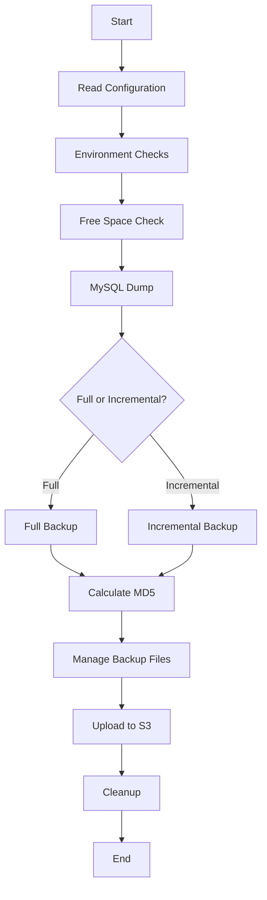

# VoipNow Backup Script

## Overview

This script performs backups for a VoipNow system, including both database and file system backups. It supports full and incremental backups, compression, and uploading to remote storage (FTP, SCP, or S3).

## Features

- MySQL database backup using mysqldump or xtrabackup
- File system backup (full and incremental)
- Compression (gzip, bzip2, or pbzip2)
- Remote storage support (FTP, SCP, or S3)
- Email notifications
- Cleanup of old backups

## Process Flow

## Code Review

1. **Configuration Management**: The script uses multiple configuration files, which is good for organization but might be complex to maintain. Consider consolidating configurations where possible.

2. **Error Handling**: The script has good error handling in many places, using the `LogMessage` function to report issues. However, some areas could benefit from more robust error handling.

3. **Security**: Sensitive information like database credentials and S3 keys are stored in configuration files. Consider using environment variables or a secure secret management system.

4. **Modularity**: The script defines many functions, which is good for modularity. However, some functions are quite long and could be broken down further.

5. **Compatibility**: The script checks for the presence of required tools and libraries, which is good for ensuring compatibility across different systems.

6. **Logging**: The script has a comprehensive logging system, which is excellent for troubleshooting and auditing.

7. **Remote Storage**: The script supports multiple remote storage options, which is flexible but increases complexity. Each storage method could potentially be moved to its own module.

8. **Backup Strategy**: The script supports both full and incremental backups, which is a good strategy for balancing backup completeness and efficiency.

9. **Cleanup**: The script includes functions for cleaning up old backups both locally and remotely, which is important for managing storage space.

10. **Dependencies**: The script uses several external libraries (boto3, botocore, MySQL-python, bz2file). Make sure these dependencies are clearly documented and versioned.

## Recommendations

1. Consider using a configuration management library like `configparser` for easier config file handling.
2. Implement more comprehensive error handling and recovery mechanisms.
3. Use a secure method for handling sensitive information.
4. Break down larger functions into smaller, more manageable pieces.
5. Consider implementing unit tests for critical functions.
6. Use type hinting to improve code readability and catch potential type-related errors.
7. Implement logging using Python's built-in `logging` module for more flexibility.
8. Consider using object-oriented programming to encapsulate related functionality.
9. Implement a proper CLI interface using a library like `click` or `argparse`.
10. Add more inline documentation to explain complex logic or algorithms.

## Conclusion

The VoipNow backup script is a comprehensive solution for backing up VoipNow systems. It offers flexibility in terms of backup methods and storage options. While it's functional, there are opportunities to improve its structure, security, and maintainability.
